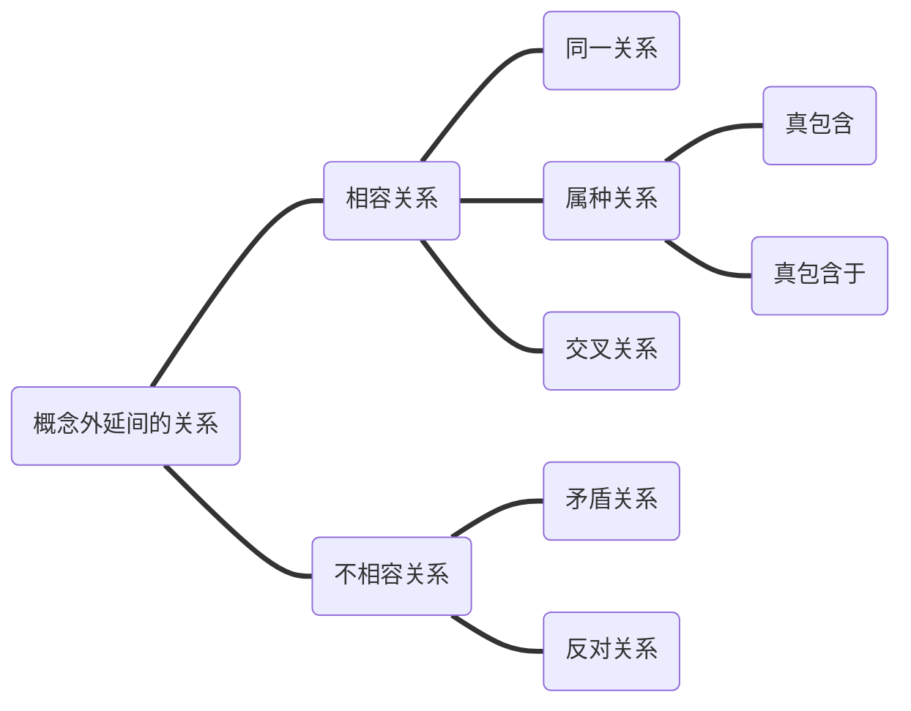

#### 第一章 绪论

1. 逻辑学及其研究对象

   “逻辑”是一个外来词，它是英文“Logic”的音译意为思想、言辞、理性、规律等。

   **“逻辑”常见的四种含义。**

   - 指客观事物的规律

   - 指某种特殊的理论、观点或者问题的方法。

   - 指思想的规律、规则。

   - 指逻辑学这门学科。
   
   思维是认识的理性阶段，在这个阶段，人们在感性的基础上，形成概念，并用其构成命题（判断）、推理和论证。
   
   **思维的主要特点：**
   
   - 概括性
   - 间接性
   
   思维的类型   **概念、命题、推理（逻辑研究对象）**
   
   **概念**是反映事物本质属性的思维形式。
   
   **命题**是指一个判断（[陈述](https://baike.baidu.com/item/陈述/10711)）的语义（实际表达的概念）。
   
   命题分为：简单命题（直言命题、单称命题、关系命题）、复合命题（负命题、联言命题、选言命题、假言命题）、模态命题
   
   **推理**：按照前提和结论之间的关系的不同，区分为演绎推理和归纳推理。
   
   **思维和语言的关系**
   
   - 思维通过语言反应事物
   - 语言是思维的物质外壳
   - 语言的发展依赖于思维的发展
   
   **语言的分类**  自然语言&人工语言
   
   - 自然语言是人们在思维和交际中使用的语言；
   - 人工语言是为了某种目的而创建的表意符号系统。
      例如  
（1）自然语言：所有的金属都是导电的。 人工语言：SAP 
（2）自然语言：如果天气好，那么我们就去爬山。人工语言：p→q
   
   **逻辑学的研究对象**  
   
   逻辑学是研究思维的形式及其规律和方法的科学。逻辑学的任务便是通过对推理的研究，向人们提供统一原则、规则、方法和技术，使得人们能够根据这些原则、规则、方法和技术来正确地进行推理和论证，识别、揭露和反驳错误地推理和论证。
   
2. 推理的组成及其评价

   **推理的定义**：推理是从一个或者一些已知的命题得出新命题的思维过程或思维形式，其中已知的命题是前提，得出的新命题是结论。

   例如：

	如果谁想活得明白一点，谁就必须拥有足够的资讯。谁都想活得明白一点，所以，谁都必须拥有足够的资讯。

    所有的科学都是有价值的。有的理论是科学。所以，有的理论是有价值的。

   **推理的分类**  演绎推理&归纳推理  

   - 演绎推理：是必然性推理，即前提真能够确保结论真。  
   - 归纳推理：是或然性推理，前提只对结论提供一定的支持关系。

   **对推理的评价**  

   - 演绎推理：逻辑上采用“有效”、“无效”这样的标准进行评价。  
   - 归纳推理：逻辑上采用“强”和“弱”这样的强度标准来评价。

   **演绎推理的有效性**  

   如果一个演绎推理的结论确实是从前提中必然推出来，那么这个演绎推理就是有效的。  推理的有效性与构成推理的命题真假无关。

   **归纳推理的强度** 

   -  一个归纳推理，如果当所有的前提都真时结论极有可能为真，那么这个归纳推理就是强的。 
   -  一个归纳推理，如果当所有的前提都真时结论仍不大可能为真，那么这个归纳推理就是弱的。
   - 例子：  昨天的太阳从东方升起。今天的太阳从东方升起。所以，明天的太阳从东方升起。  迄今为止，太阳每天从东方升起。所以，明天太阳从东方升起。

#### 第二章 概念

1. 概念

   **概念**是反应事物本质属性的思维形式。
   概念 ---> 命题 ---> 推理
   概念反映的事物是客观世界中的事物：自然界中的山川、草木、虫鱼等；人类社会中的国家政党、金融货币等；还存在与人类思维中感觉、知觉、表象等。

   ##### 1.1 事物的属性

   事物的属性是指事物的性质以及事物之间的关系。
   例如：水是无色、无嗅、无味透明的液体。
           水是人类和其他动植物都离不开的事物。

| 本质属性| 非本质属性 |
| --- | --- |
| 区别其它事物的属性具有唯一性 | 这个事物的归属和分类并不具有决定性的属性 |
	例如：人有四肢，能走路，能构制造使用工具，会思考的动物。

##### 1.2 概念与语词

+ 概念是语词的思想内容，语词是概念的语言形式，两者的区别在于：
	
+ 概念是思维形式的范畴，而语词属于语言的范畴。
	
+ 概念需要语词来表达，但并不是所有的语词都表达概念。
	
+ 概念和语词之间并不是一一对应的关系。
	  
 tips：同一个概念可以用不同语词表达；统一语词可以表达不同概念。


2. 概念的内涵与外延

   **2.1 概念的内涵**

   - 是指反应在概念中的思维对象所具有的本质属性。

   - 例如：

     “食物”的内涵是指能够满足机体正常生理和生化能量需求，并能延续正常寿命的物质。

   **2.2 概念的外延**

   - 是指具有概念所反应的本质属性的全部对象，是概念的对象范围和数量。

   - 例如：

     “食物”这个概念的外延是指具有食物这种本质属性的物质所组成的集合，包括水果、蔬菜、肉类等一个个的个体。
   
   概念的内涵决定外延，概念的内涵与外延存在**反变关系**
   
   **2.3 概念的限制**
   
   - 是指通过增加概念的内涵以缩小概念外延的逻辑方法。
   
   - 例如：
   
     保险 ——> 养老保险  ——>城乡居民养老保险（从一般到特殊）
   
   **2.4 概念的概括**
   
   -  是指通过减少概念的内涵来扩大概念的外延的逻辑方法。
   
   - 例如：
   
     人 ——> 动物 ——> 生物（从特殊到一般）


3. 概念的种类

   3.1 按照概念外延的特点分为单独概念、普遍概念概念、空概念。

   **3.1.1 单独概念**

   - 是指反映某一个事物的概念，它的外延仅指一个单独的对象。也就是说这个概念所反映外延的个体是世界上独一无二的。

   - 例如：
   
     中国、莫言、世界上最高的山峰、中国最长的河流。
   
   **3.1.2 普遍概念概念**
   
   - 是反映两个以上对象的概念，一般用词语中的普遍名词、动词、形容词来表达。
   
   - 例如：
   
     国家、汽车、植物。
   
   **3.1.3 空概念**
   
   - 反映的对象是一个空类。也就是世界上不存在的事物。
   - 例如：理想气体、上帝、神仙。
   
   **3.2** 按照概念外延所反映的一类事物是否可以分割分为集合概念、非集合概念。同一个概念因语言环境的不同可以是集合概念也可以是非集合概念
   
   例如：
   “**中国人**是勤劳勇敢的“。<表达集合概念>
   “**中国人**是炎黄子孙”。	<不表达集合概念>
   
   **3.2.1 集合概念**
   
   - 集合概念是指把对象事物作为一个不可分割的整体加以反映的概念，如：“中国女排“、”鲁迅文集”等。
   
   **3.2.2 非集合概念**
   
   - 非集合概念是指不把对象事物作为一个不可分割的整体加以反映的概念，也称为类概念，如：“学生”、“卫星”、“老师”。
   
   3.3 按照概念是否具有某种属性分为正概念和负概念
   
   **3.3.1 正概念**
   
   - 正概念是反映对象具有某种属性的概念。如：古典文学、工作人员
   
   **3.3.2 负概念**
   
   - 负概念是反映对象不具有某种属性的概念。如：非正义战争、未成年人
   
4. 概念的外延间的关系。按照两个概念之间**重合程度**的不同可以分为相容关系、不相容关系。


   **同一关系**：如果两个概念的外延完全重合，那么这两个概念在外延上属同一关系。内涵相同外延相同，叫做同一概念的不同语词表达；内涵不同外延相同叫做两个概念的同一关系。

   **属种关系**：如果一个概念的外延完全重合在另一个概念的外延之中，并且仅仅是另一个外延的一部分，则这两个概念之间的关系是属种关系。可以参考集合关系。

   **交叉关系**：交叉关系是指一个概念的部分外延于另一个概念的部分外延重合的关系。集合中的交集。

   **矛盾关系**：同一个属概念下的两个不相容的种概念，如果让其外延之和等于属概念的全部外延，则这两个概念的关系是矛盾关系。A+B = C.

   **反对关系**：同一个属概念下的两个具有不相容的种概念，如果其外延之和小于属概念的全部外延，则这两个概念间的关系是反对关系。A+B<C


5. 定义	

	- 是揭示概念内涵的逻辑方法。例如：商品是用于交换的劳动产品；人是能制造和使用劳动工具的动物。
   - 从结构上说，定义是由被定义项（Ds），定义联项（连接词）和定义项(Dp)三部分组成。
   - 重要作用是用来消除歧义。

   ```mermaid
   graph LR;
   A(定义)===B(属加种差定义法)
   A===C(语词定义法)
   ```

   

   **属加种差定义法的类型**：

   - 性质定义：以事物的性质为种差的定义。例如：人就是能够制造和使用生产工具的动物。
   - 发生定义：以事物形成的方式或方法为种差的定义。例如：月蚀是地球运行于月球和太阳之间，三者成一直线时所引起的天文现象。
   - 关系定义：以事物间的关系为种差的定义。例如：直系家族是指和本人有直接血缘关系或 婚姻关系的人。
   - 功用定义：以事物的功能为种差的定义。例如：血压计就是用来测量血压的仪器

   **属加种差定义法**：由属和种差异构成定义项的定义。例如：`氧`是`核电荷数为8`的元素

   ​	结构：被定义项=种差+临近的属概念。

   ​	“种差”：被定义项时所指对象区别于其他对象所特有的属性。

   ​	“临近的属概念”

   **语词定义的类型**

   - 说明的语词定义：如，“乌托邦”，正确与否
   - 规定的语词定义：如，“一国两制”，妥当与否

   **语词定义适用场景和范围**

   | 1.古语、土语、外来语 | 2.符号公式、简称表达复杂概念         | 3.使用新语词                                                 | 4.在新的意义上使用的旧语词                 | 5.确定虚幻概念的含义             |
   | :------------------- | ------------------------------------ | :----------------------------------------------------------- | ------------------------------------------ | -------------------------------- |
   | 例：骥表示好马。     | 例：“双创”就是“大众创新”和“万众创业” | 例：”网红“是在现实或者网络生活中因为某个事件或者某种行为而被网民关注从而走红的人。 | 例：”君子协定“就是不用书面缔约达成的协定。 | 例：”白骨精“指阴险善变的女坏蛋。 |

   **定义的规则**

   | 1.定义项的外延必须与被定义项的外延全同                       | 2.定义项不能直接或间接包含定义项                             | 3.定义不能使用含混地言辞或比喻                               | 4.只要能用肯定的就不应当用否定的。                         |
   | ------------------------------------------------------------ | ------------------------------------------------------------ | ------------------------------------------------------------ | ---------------------------------------------------------- |
   | 否则犯”定义过宽“或”定义过窄“的逻辑错误。比如”宪法就是国家的法律。“ | 定义项直接包含被定义项叫”同语反复“。“所谓故意杀人罪，就是因故意杀人而构成的犯罪。”定义项间接包含被定义项，叫”循环定义“。”所谓直系亲属就是旁系亲属之外的亲属。“ | 否则犯”定义用语含混“、”用比喻代替定义“地逻辑错误。比如”宗教是人们精神上的鸦片“。 | 否则犯”定义否定“的逻辑错误，比如”过失犯罪就是非故意的犯罪“ |

   

6. 划分

   概念的划分是把一个属概念按照一定的标准分成若干个种概念，以揭示概念外延的逻辑方法。

   例如：”动物“划分为”无脊椎动物“和”脊椎动物“；

   ​			”脊椎动物“可划分为”鱼类“，”两栖动物“，”爬行动物“，”鸟类“和”哺乳动物“。

   ```mermaid
   graph LR;
   A(划分)===B(母项)
   A===C(子项)
   A===D(划分依据)
   ```

   **划分与分解**

   分解时把一个事物分为若干部分，被分解对象和分解的对象后的对象之间是整体与部分的关系，部分不具有整体的属性。

   例如：地球可分为“南半球”和“北半球“

   划分后的概念和被划分的概念之间是种属关系，划分后的概念具有其被划分概念的属性。

   **划分与分类**

   分类是根据事物的本质属性或显著特征将概念所反映的对象分为若干个类别，使每一类相对于其他类都有确定的地位。

   划分使分类的基础，任何分类都是划分，但不是所有的划分都是分类。

   例如：人按照性别可以分为男人和女人，这是分类也是划分，但是人如果分为教室里的人和教师外的人，这是划分，不是分类。

   **划分的类型**

   - 根据每次划分得到的子数量不同可分为`二分法、多分法。`
     - 二分法   行为：合法&非法；国家：有核&无核
     - 多分法   艺术：表演&造型&语言&综合  
   - 根据划分所包括的母项和子项的层次数量不同可分为`一次划分、连续划分`
     - 一次划分	生物：植物、动物、微生物。
     - 连续划分    科学分为自然科学、社会科学、哲学。自然科学可划分为数学、物理学、化学、天文学、地理学、生物学。

   **划分的规则**

   - 划分必须相应相称。
     - “燃料工业分为煤炭工业、石油工业、原子能工业以及天然气加工工业”<多出子项>
     -  “日蚀包括日全食和日”<划分不全>
   - 在同一次划分中标准必须同一。
     - “杂志分为零刊、月刊、自然科学刊物、外文刊物。”<混淆根据>
   - 划分后的子项应该是相互排斥的。
     - “戏剧分为悲剧、喜剧、舞剧、话剧、地方剧、儿童剧等”<子项相同>
   - 划分不能越级。
     - “句子分为主从复句和并列复句。”

  

   ### 第三章 直言命题

   #### 一、直言命题的含义和结构

   1. 直言命题是什么？

      是断定一类对象的全部或部分是否包含在另一类对象之中的命题。

      比如:所有的`团员`都是`青少年`。所有的`犯罪行为`都是不合法的。有些学校是综合类的。有些动物不是哺乳动物。

   2. 直言命题的结构。

      例：所有的哺乳动物是动物。

      - 逻辑常项
        - 量项
          - 全程量项	“所有”
          - 特称量项    “有些”  ☞ `至少一个`
        - 联项
          - 肯定联项	“是”
          - 否定联项    “不是”
      - 逻辑变项
        - 主项	“S”
        - 谓项    “P”

   #### 二、直言命题的种类

   根据联项和量项的不同可以把直言命题分为四种类型：

   |     名称     |  逻辑形式  | 缩写 | 简称 |
| :----------: | :--------: | :--: | :--: |
   | 全称肯定命题 |  所有S是P  | SAP  |  A   |
| 全程否定命题 | 所有S不是P | SEP  |  E   |
   | 特称肯定命题 |  有些S是P  | SIP  |  I   |
| 特称否定命题 | 有些S不是P | SOP  |  O   |
   
#### 三、直言命题的逻辑特征

**常项的逻辑特征**——“质”和“量”

- 直言命题的“质”指的是直言命题的联项，分为“肯定”和“否定”两种。    所有的哺乳动物是动物。

- 直言命题的“量”指的是直言命题的联项，分为“全称”和“特称”两种。    有些学生不是学霸。

**变项的逻辑特征**——周延性，是指在直言命题中对主项和谓项外延的断定情况。	

| 命题类型 |  主项  |  谓项  |
| :------: | :----: | :----: |
|   SAP    |  周延  | 不周延 |
|   SEP    |  周延  |  周延  |
|   SIP    | 不周延 | 不周延 |
|   SOP    | 不周延 |  周延  |

   #### 四、直言命题的对当关系

**对当关系**：相同素材的直言命题间的真假制约关系

   - AE 反对关系		——至少一假		A                        E
   - IO 下反对关系     ——至少一真
   - AI & EO差等关系——全称真则特称真；特称假则全称假。 
   - EI & AO矛盾关系——真值相反          I                         O

**A、E、I、O四中命题在主项于谓项概念间五种关系中的真假情况**

| 命题\|外延 | S属于P | S真属于P | P真属于S | S交于P | S与P |
| ---------- | ------ | -------- | -------- | ------ | ---- |
| SAP        | 真     | 真       | 假       | 假     | 假   |
| SEP        | 假     | 假       | 假       | 假     | 真   |
| SIP        | 真     | 真       | 真       | 真     | 假   |
| SOP        | 假     | 假       | 真       | 真     | 真   |

  **使用直言命题对当关系的注意事项**

- 对当关系是同素材的四种直言命题之间的真假关系。

#### 五、直言命题对当关系直接推理

> **并非：**并不是**。 [1]** 如：并非如此，意思是说“其实这件事，并不是你想像的那样，有可能存在另外一种隐情”。否定。与[不是](https://baike.baidu.com/item/不是)同义

矛盾关系可以互推，

反对关系至少一假。下反对关系是至少一真。`一个假推出真的。`

#### 六、换质法与换位法

- 换质法	通过改变一个直言命题的质，并且同时否定这个直言命题的谓项而得到一个新的直言命题的推理方法。
  - 步骤 
    - 第一，改变直言命题的质，肯定的变为否定的，否定的变为肯定的；
    - 第二，否定原直言命题的谓项。
  - 推理     凡犯罪行为都是违法行为。所以，凡犯罪行为都不是不违法行为。
- 换位法    通过交换一个直言命题中的主项和谓项的位置而得到一个新的直言命题的推理方法。
  - 规则
    - 第一，换位法只交换原直言命题中的主、谓项的位置、不改变它的质；
    - 第二，换位前不周延的项，换位后仍不得周延。
  - 推理    所有的科学理论都不是迷信。所以，所有的迷信都不是科学理论。
- 换质法与换位法恶的综合运用

   

   

   